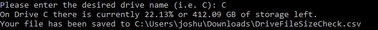
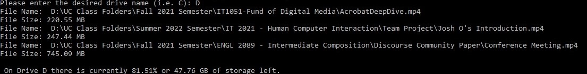

<h1 align="center">💾 Drive Check 💾</h1>
<h2>Table of Contents</h2>
<ul>
  <li><a href="https://github.com/oreskojh/it3038c-scripts/tree/main/Final%20Project#why-use"> Why Use</a></li>
  <li><a href="https://github.com/oreskojh/it3038c-scripts/tree/main/Final%20Project#features">Features</a></li>
  <li><a href="https://github.com/oreskojh/it3038c-scripts/tree/main/Final%20Project#before-you-run-the-script">Before You Run</a></li>
  <li><a href="https://github.com/oreskojh/it3038c-scripts/tree/main/Final%20Project#script-instructions">Script Instructions</a></li>
  <li><a href="https://github.com/oreskojh/it3038c-scripts/tree/main/Final%20Project#demo">Demo</a></li>
  <li><a href="https://github.com/oreskojh/it3038c-scripts/tree/main/Final%20Project#expected-results">Expected Results</a></li>
  <li><a href="https://github.com/oreskojh/it3038c-scripts/tree/main/Final%20Project#sources">Sources</a></li>
</ul>
<h2>Why Use?</h2>

While it is easy to see how much storage space a drive has left, it isn't always so easy to identify large files on a system. A consistently used computer can contain numerous files stored in a multitude of different  directories. Additionally, some people also consistently use multiple drives on their computer which further complicates identifying larger files. This script provides the user to check a specific drive to identify all the files larger than 200MB.

<h2>Features</h2>
<ul>
  <li>User Selectable Drive</li>
  <li>Free Storage Space Checker</li>
  <li>Lists Files Larger than 200MB or Outputs Into a .CSV file</li>
  <li>Can Be Run More Than Once</li>
</ul>
<h2>Before You Run the Script</h2>
<ul>
  <li>You will be requested to enter a drive name. The input is not case sensitive, but you will need a correct name otherwise the script will continually ask you to input a valid drive name.</li>
  <li>You do not need to enter ":\" as part of the drive name.</li>
  <li>The script runtime will vary depending on the number of files stored within the drive because the script will run through every single non-hidden file stored on the drive.</li>
  <li>You will need some form of PowerShell tool that has PowerShell version 7.2 or higher in order to run because earlier versions of PS do not allow for you to export a hash table into a CSV file. The Script Instructions will be using PowerShell Core. If you don't already have it, you can download it from <a href="https://github.com/PowerShell/PowerShell/releases/" target="_blank">GitHub</a>. Download the latest version with a .msi extension</li>
</ul>
<h2>Script Instructions</h2>
<ol>
  <li><a href="FinalProject.ps1">Download</a> the FinalProject.ps1 raw script file from my GitHub Repo.</li> 
  <li>Locate the script's download path. The default download location should be <code>$HOME\Downloads\</code>but can vary depending on settings.</li>
  <li>Open PowerShell core</li>
  <li>Change your directory using <code>cd</code> to change the directory to your download location to the download location. </li>
  <li>Input <code>powershell FinalProject.ps1</code> into the command line and hit enter to start the script.</li>
  <li>Enter a drive name you want to check.</li>
  <li>Once the script has run, it will ask you if you want to continue. You can use one of the following options:</li>
  <ul>
    <li>Input 'y' or 'yes' if you want to run through the script again, it is case insensitve, and hit enter.</li>
    <li>Enter any key and hit enter or hit enter to end the script.</li>
  </ul>
  <li>Once you don't input 'y' or 'yes' the script will end.</li>
</ol>
<h2>Demo</h2>

https://github.com/oreskojh/it3038c-scripts/assets/74508224/4539418d-179e-484a-90e8-fb6bff205b5b

<h2>Expected Results</h2>

In one way or another, the script will output a list of file names with their full paths and their file size; as well as, the remaining storage left over in the drive the user selected. The two primary expected results should be: 

<ul>
  <li>If the user has more than 10 files that are larger than 200MB, then the results will be output to a CSV file found in <code>$HOME\Downloads\</code> with a file name of "DriveFileSizeCheck.csv" When you open up the file, the list of results will be in descending file size. A column for the full file name/path will exist and a column with the file size in Bytes will exit. Please see the screenshots below to see these results:</li>
  <ul>
     <li></li> 
    <li></li>  
    <li></li>
  </ul>
  <li>If the user has 10 files or less files larger than 200MB but greater than 0, the file full file name/path and file size in MegaBytes will be listed. The screenshot below shows what this looks like, as well as the expected terminal output if the user has more than 10 files larger than 200MB:</li>
  <ul><li></li></ul>
  <li>Finally, if you have zero files that are larger than 200MB, then you will get a message saying you don't have any files larger than 200MB as well as the current available drive space.</li>
</ul>
<h2>Sources</h2>
<ul>
  <li><b>Project 1 and Project 2:</b> Much of the code was pulled from my <a href="https://github.com/oreskojh/it3038c-scripts/blob/main/Project1/Project1.ps1">Project 1</a> and <a href="https://github.com/oreskojh/it3038c-scripts/blob/main/Project2/Project2.ps1">Project 2</a> scripts with the necessary alterations to fit what I wanted to do on this project.</li>
  <li><b><a href="https://learn.microsoft.com/en-us/powershell/scripting/how-to-use-docs?view=powershell-7.3">Microsoft's PowerShell Documentation</a>:</b> I used Microsoft's PowerShell Documentation to validate syntax and to answer most questions I had in how to do specific things.</li>
  <li><b><a href="https://stackoverflow.com/questions/68056955/user-input-validation-in-powershell">Stack OverFlow Article</a>: </b>I used this article to assist in the creation of my exception handling to continuously loop if the user provided an incorrect drive name. I made the necessary changes such as changing the call operator to a dot operator as well as my script specific operations.</li>
</ul>
