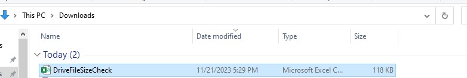
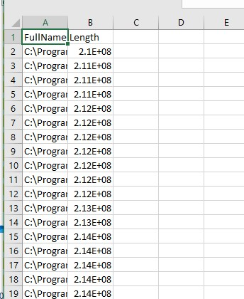
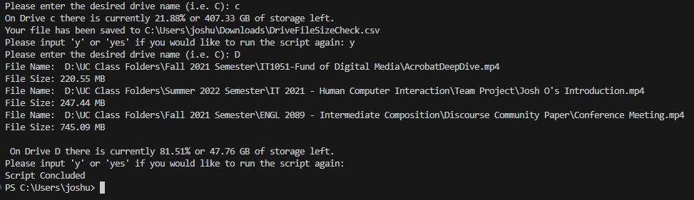

<h1>Final Project Documentation</h1>
<h2>Project Usefulness</h2>

While it is easy to see how much storage space you have left on a certain drive, it isn't always so easy to identify large files on a system. This is especially true if the computer is older in which it contains numerous files in a variety of directories. Additionally, some people also consistently use multiple drives on their computer which further complicates identifying larger files. This script is useful in that it allows the user to input a valid drive name and it recursively goes through the entire drive to identify files larger than 200MB.

<h2>Before You Run the Script</h2>
<ul>
  <li>You will be requested to enter a drive name. The input is not case sensitive, but you will need a correct name otherwise the script will continually ask you to input a valid drive name.</li>
  <li>You do not need to enter ":\" as part of the drive name.</li>
  <li>The script runtime will vary depending on the number of files stored within the drive because the script will run through every single non-hidden file stored on the drive.</li>
  <li>You will need some form of PowerShell tool that has PowerShell version 7.2 or higher in order to run because earlier versions of PS do not allow for you to export a hash table into a CSV file. The Script Instructions will be using PowerShell Core. If you don't already have it, you can download it from <a href="https://github.com/PowerShell/PowerShell/releases/">GitHub</a>. Download the latest version with a .msi extension</li>
</ul>
<h2>Script Instructions</h2>
<ol>
  <li>Download the FinalProject.ps1 script from GitHub</li>
  <li>Locate the script's download path. The default download location should be <code>$HOME\Downloads\</code>but can vary depending on settings.</li>
  <li>Open PowerShell core</li>
  <li>Change your directory using <code>cd</code> to change the directory to your download location to the download location. </li>
  <li>Enter a drive name you want to check.</li>
  <li>Once the script has run, it will ask you if you want to continue. You can use one of the following options:</li>
  <ul>
    <li>Input 'y' or 'yes' if you want to run through the script again, it is case insensitve, and hit enter.</li>
    <li>Enter any key or hit enter to end the script.</li>
  </ul>
  <li>Once you don't input 'y' or 'yes' the script will end.</li>
</ol>
<h2>Expected Results</h2>

In one way or another, the script will output a list of file names with their full paths and their file size; as well as, the remaining storage left over in the drive the user selected. The two primary expected results should be: 

<ul>
  <li>If the user has more than 10 files that are larger than 200MB, then the results will be output to a CSV file found in <code>$HOME\Downloads\</code> with a file name of "DriveFileSizeCheck.csv" When you open up the file, the list of results will be in descending file size. A column for the full file name/path will exist and a column with the file size in Bytes will exit. Please see the screenshots below to see these results:</li>
  <ul>
    <li></li>
    <li></li>
  </ul>
  <li>If the user has 10 files or less files larger than 200MB but greater than 0, the file full file name/path and file size in MegaBytes will be listed. The screenshot below shows what this looks like, as well as the expected terminal output if the user has more than 10 files larger than 200MB:</li>
  <ul><li></li></ul>
  <li>Finally, if you have zero files that are larger than 200MB, then you will get a message saying you don't have any files larger than 200MB as well as the current available drive space. There are no screenshots for me to provide since I would need to delete the files from the drive in order to demonstrate the results.</li>
</ul>
<h2>Sources</h2>

The code is mostly original. Much of the code was pulled from my Project 1 and Project 2 scripts with the necessary alterations to fit what I wanted to do on this project. I did use primarily use <a href="https://learn.microsoft.com/en-us/powershell/scripting/how-to-use-docs?view=powershell-7.3">Microsoft's PowerShell Dcoumentation</a> for assistance when I needed it. Finally, there was one area where I needed assistance in regards to my exception handling to continuously loop. I used this <a href="https://stackoverflow.com/questions/68056955/user-input-validation-in-powershell>Stack Overflow</a> article to provide the help I needed. I made necessary changes such as changing the call operator to a dot operator as well as my own input and exception error message. 

