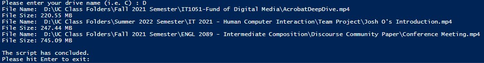

<h1>Project 2 Documentation</h1>
<h2>Script Goal</h2>
<body>
  
The purpose of this script is to list which files in the user's selected drive are above 200MB.

  <h2>Before You Run the Script</h2>
  
Please read through the list of notes before running the script.

  <ul>
    <li>You will be requested to enter a drive name. The input is not case sensitve.</li>
    <li>You do not need to enter ":\" as part of the drive name.</li>
    <li>The script runtime will vary depending on the number of files stored within the drive because the script will run through every single non-hidden file stored on the drive.</li>
  </ul>
  <h2>Script Instructions</h2>
  <ol>
    <li>Download the script from GitHub</li>
    <li>Locate the script's download location</li>
    <li>Right click the file and select "Run with Powershell"</li>
    <li>Enter the drive name. </li>
    <li>Once you have run the script. Hit "Enter" to exit out of the script window.</li>
  </ol>
  <h2>Expected Results</h2>
  
The script should provide a full list of files that are greater than 200 MB in descending order.  
    The final results should display the full file path and the file size in MB.  
    Please see the screenshot below of an example of what the results should look like:

    
  <h2>Sources</h2>
  
</body>
