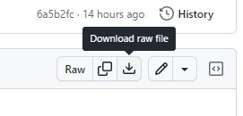
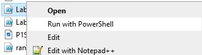
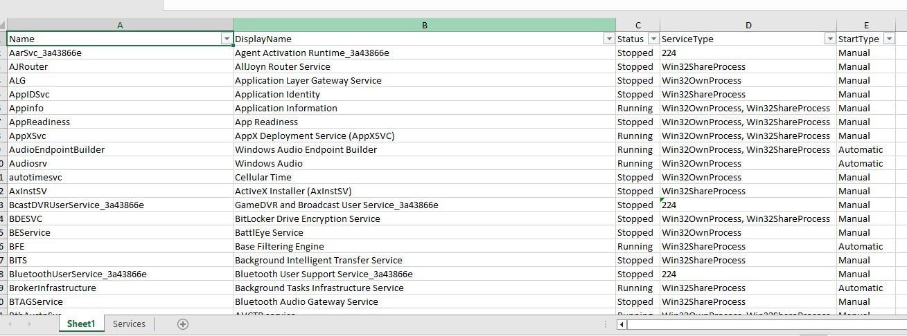
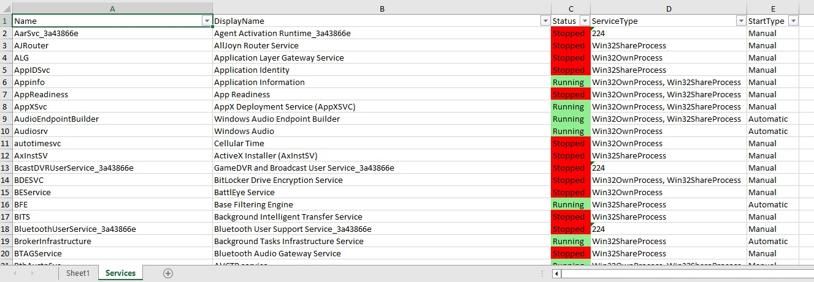

<h1>Lab 7 How To Run</h1>

This Readme is to demonstrate how to run my Lab 7 Powershell Script  
The module that will be used is the ImportExcel PowerShell Module that allows you to more readily edit Excel sheets and workbooks.

<body>
 <h2>Script Description</h2>
  
The script itself only requires input at the End. This script will also be automatically created in your "Downloads" folder. 
    Within this script it demonstrates:
    <ul>
      <li>You are able to run PowerShell commands such as <code>Get-Service</code> and export the results to a new Excel Workbook with autosized columns, filtering option arrows already available, and opening upon creation.</li>
      <li>You can create additional sheets as necessary and copy the content on original sheet that was created.</li>
      <li>Conditional formatting can be added to the sheets from PowerShell</li>
  <h2>Install the Module</h2>
  <ol type = "1">
    <li>Run a PowerShell instance as administrator</li>
    <li>Run the following command:  
        <pre><code>Install-Module -Name ImportExcel</code></pre> </li>
    <li>Input "a" when prompted then hit "Enter"</li>
  </ol>
    <h2>Running the Script</h2>
      
Below are the steps on how to run the script:

      <ol type = "1">
        <li>Download the Script from GitHub 
        </li>
        <li>Locate the Lab7.ps1 script in the downloads page</li>
        <li>Right-click and select "Run with PowerShell"  
        </li>
        
At this point the script will run automatically and run through the aforementioned things described in the "Script Description" section.

        <li>The Excel document will then automatically open and display two separate sheets with the conditional formatting on the "Services" sheet. The Excel sheets should be similar to the images below: 
        <h4>Sheet1 Sheet</h4>  <h4>Services Sheet</h4> </li>
        <li>After the script has run, go back into the PowerShell Window and hit "Enter" to end the script.</li>
      </ol>
      
  <h2>Post-Script Process</h2>
  <ul>
    <li>After the script has been run, it can be run again using the same steps. The script is designed to delete the old sheet upon running. However, be sure to close out the Excel sheet before running the script again.</li>
  <li>If you don't want the module installed on your machine after running my script, then you can uninstall it by opening up a new PowerShell instance as an Admin and running: 
  <pre><code>Uninstall-Module -Name ImportExcel</code></pre></li>
  </ul>
</body>
